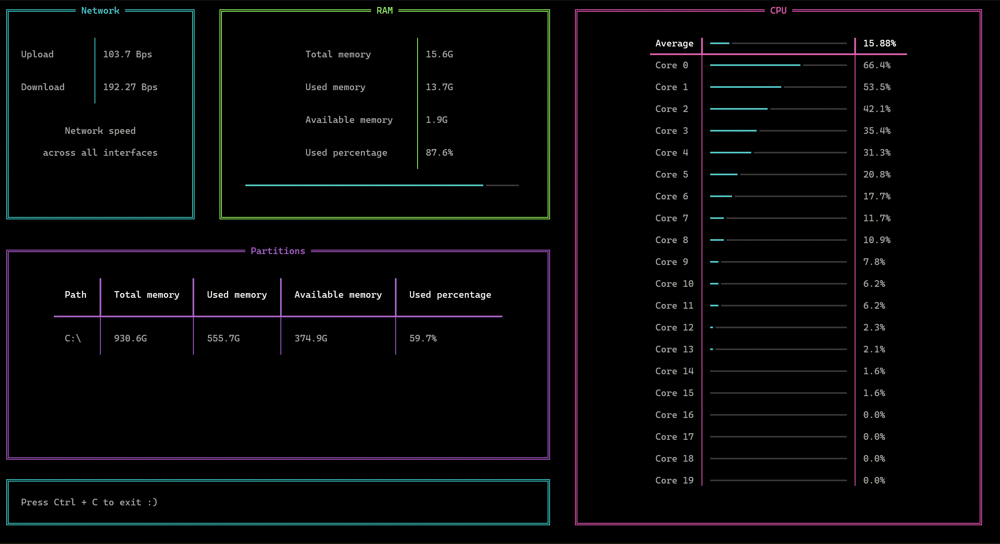

# SysMon
> A CLI tool for monitoring system performance live.

SysMon tracks CPU, RAM, partitions and network metrics from your terminal, and presents the data on a live dashboard with
threshold alerts, logging and daily reports.

My first python project!

---



---

## Features

- **Live dashboard** - continuously updating dashboard with color coded panels that turn red when thresholds are breached
- **Data tracking** - CPU tracking for each core alone and combined, RAM and partition tracking for total, used, 
available, percentage of memory, plus upload and download network speed.
- **Threshold alerts** - desktop notifications every 25 seconds if CPU or RAM percentage exceed your desired threshold.
- **Logging** - appends timestamped readings to a file as JSON lines, logs errors and warnings as well.
- **Daily reports** - presents a min/avg/max analysis of every metric for a given log file and date.

---

## Installation

```bash
git clone https://github.com/bossyshrimp68/SysMon.git
cd SysMon
pip install sys-mon
```

---

## Usage

### Basic monitoring
```bash
sys-mon
```

### With logging
```bash
sys-mon --log /path/example.txt
```

### With a custom CPU updating interval (in seconds, default is 2)
```bash
sys-mon --interval 5
```

### With thresholds for CPU average usage or used RAM, represents a percentage 0-100
```bash
sys-mon --cpu-warn 50 --mem-warn 80
```

when a threshold is breached:
- its corresponding display panel will turn red
- an alert will appear every 25 seconds
- it will be logged as a warning

---

## Daily reports

Generate a min/avg/max analysis for a specific date in a log file:

```bash
sys-mon report --rlog log/file/path.txt --date 2026-3-30
```

- --rlog - path of the log file from which to generate the report.
- --date - the date to report on, must be in the format y-m-d.

## All flags
| Flag         | Description                            | Default              |
|--------------|----------------------------------------|----------------------|
| `--log`      | Path for the log file writing          | None                 |
| `--interval` | CPU update interval in seconds         | 2                    |
| `--cpu-warn` | CPU usage percentage threshold (0–100) | 100 (never breached) |
| `--mem-warn` | RAM usage percentage threshold (0–100) | 100 (never breached) |
| `--rlog`     | Log path for the file to report on     | None                 |
| `--date`     | Date to report on in the rlog file     | None                 |
